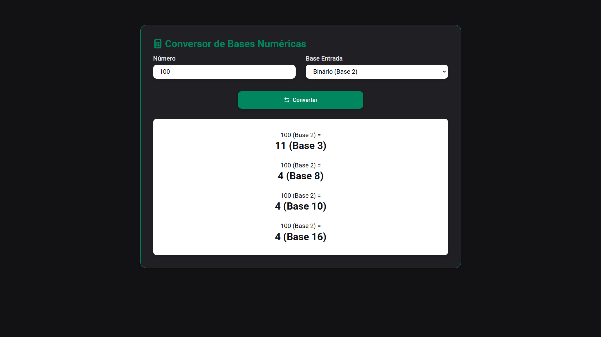

# Conversor de Bases

Este projeto é um conversor de bases desenvolvido como trabalho para a disciplina **Arquitetura e Organização de Computadores** da **Fatec Ribeirão Preto**.

## Descrição

O site permite ao usuário inserir um número em uma das cinco bases numéricas disponíveis e visualizar sua conversão automática para as demais bases.

## Preview

### Bases suportadas

- Binário (base 2)
- Ternário (base 3)
- Octal (base 8)
- Decimal (base 10)
- Hexadecimal (base 16)

## Como usar

1. Acesse o site do conversor: [https://base-converter-adriel.netlify.app/](https://base-converter-adriel.netlify.app/)
2. Escolha a base do número que deseja converter.
3. Insira o número no campo correspondente.
4. Pressione o botão de converter.
5. Veja o resultado convertido nas outras bases.

## Tecnologias utilizadas

- HTML, CSS, JavaScript, React

## Autor

Desenvolvido por Adriel para a Fatec Ribeirão Preto.
